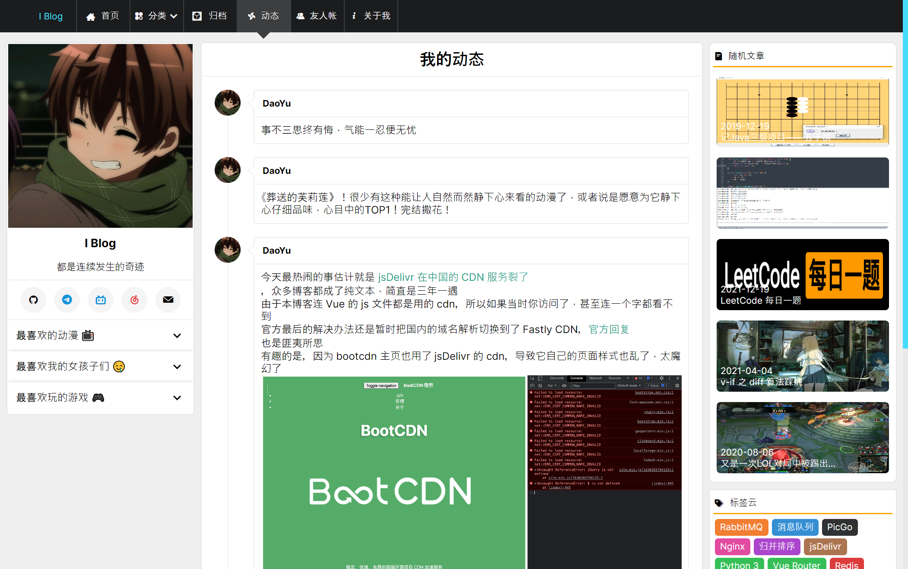

# Avalonia Blog

## 样式和示例文章来源

* 博客样式是仿  [Naccl's Blog](https://naccl.top) 写的
* 演示文章也是摘取自  [Naccl's Blog](https://naccl.top) 
* 大佬博客的Github地址 [NBlog](https://github.com/Naccl/NBlog)

## 如何运行

* 拉取代码
* 拉取子模块
* 运行

## 演示截图

### 主页

### 分类

### 归档

### 动态

### 友人帐

### 正文

正文的markdown解析仓库 **[Markdig.Avalonia](https://github.com/daoyull/Markdig.Avalonia)**
